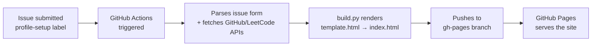

<div align="center">

```
$ ./init_portfolio.sh

[✓] fetching github stats.......... done
[✓] fetching leetcode stats........ done
[✓] compiling workspace layout...... done
[✓] injecting quiz sandbox.......... done
[✓] deploying to gh-pages........... done (30.2s)

> portfolio is LIVE at https://<you>.github.io/terminal-portfolio-generator
```

# ⚡ terminal-portfolio-generator

**A code-workspace-themed portfolio that builds itself.**
Fork it → open one issue → your portfolio is live. No HTML editing, ever.

[](../../actions)
[](../../deployments)
[](../../commits/main)
[](../../stargazers)

*(Screen recording of the live workspace goes here — tabs switching, GitHub stats panel loading, quiz sandbox in action)*

</div>

---

## `$ diff traditional-portfolio.html this-repo`

| | Traditional Portfolio | terminal-portfolio-generator |
|---|---|---|
| Setup | Manual HTML editing | Fill one GitHub Issue |
| Data | Static, goes stale | Live GitHub + LeetCode stats |
| Aesthetic | Generic template | Code-workspace / terminal theme |
| Updates | Re-edit and redeploy by hand | Re-run the Action, auto-redeploys |
| Interactivity | None | Built-in quiz sandbox |
| Hosting | You configure it | GitHub Pages, wired in already |

---

## `$ choose --setup-path`

```
┌─────────────────────────────────────────────┐
│   SELECT YOUR SETUP PATH                     │
│                                               │
│   [A] No-Code  — fork, fill a form, done      │
│   [B] Terminal — clone it, run it yourself    │
│                                               │
└─────────────────────────────────────────────┘
```

<details>
<summary><b>[A] No-Code / Click-and-Go</b> — no terminal, no editor required</summary>

<br>

1. **Fork this repo** — click **Fork** at the top right.
2. **Enable workflow permissions**
   `Settings → Actions → General → Workflow permissions → Read and write permissions → Save`
3. **Turn on GitHub Pages**
   `Settings → Pages → Build and deployment → Source: Deploy from a branch → Branch: gh-pages → / (root) → Save`
   *(the `gh-pages` branch appears automatically after step 4)*
4. **Trigger the build**
   `Issues → New Issue → fill in your profile details → Submit → add label` `profile-setup`

Your portfolio compiles and deploys in under 30 seconds.

</details>

<details>
<summary><b>[B] Terminal Wizard</b> — for developers who want local control</summary>

<br>

```bash
git clone https://github.com/YOUR-USERNAME/terminal-portfolio-generator.git
cd terminal-portfolio-generator
npm install
python build.py --local
```

Edit `template.html` directly, run `build.py` to regenerate `index.html`, then push — the Action takes over from there.

</details>

---

## `$ cat pipeline.md`



## `$ man under-the-hood`

There's no dashboard, no backend, and no database here — the entire system runs on GitHub's own primitives. A profile-setup issue is really a structured form; the Action parses its labeled fields the moment it's submitted, pulls fresh stats from the GitHub and LeetCode APIs, and hands them to `build.py`, which stamps them into `template.html` to produce a static `index.html`. That file is pushed straight to `gh-pages`, and GitHub Pages does the rest. The result: a portfolio that updates itself every time you re-run the workflow, with zero servers to maintain.

---

## `$ ls workspace/tabs/`

*(Screenshots go here, one per tab)*

- **Workspace** — the code-editor-style landing layout
- **GitHub Stats** — live-pulled contribution and repo data
- **LeetCode Stats** — real-time problem-solving performance
- **Quiz Sandbox** — the interactive, customizable quiz panel

---

## `$ fork --countdown`

```
[3] preparing to fork...
[2] setting up your workspace...
[1] going live...
[0] → https://<you>.github.io/terminal-portfolio-generator
```

**[Fork this repo now →](../../fork)**

### Roadmap

- [ ] Additional quiz categories
- [ ] Theme customization (beyond the default terminal palette)
- [ ] More stat integrations (Codeforces, Kaggle, etc.)
- [ ] One-click theme switcher in the generated site

---

<div align="center">

`built with GitHub Actions, python, and a refusal to write portfolio HTML by hand`

</div>