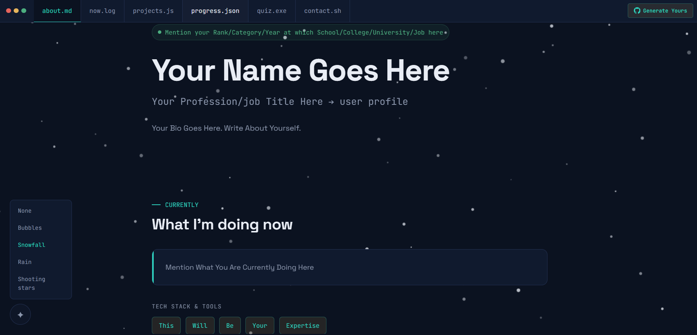
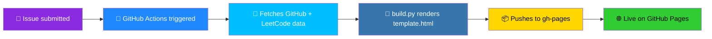
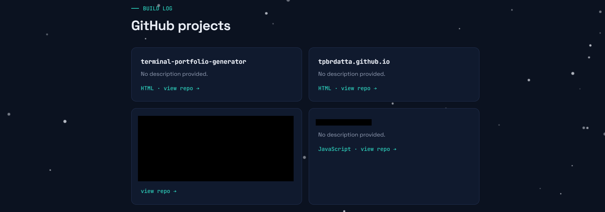
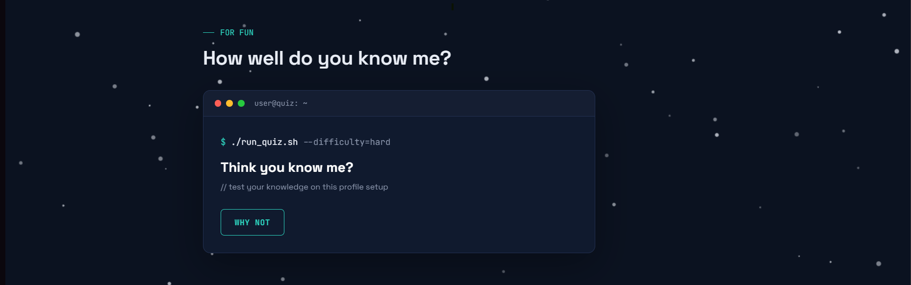
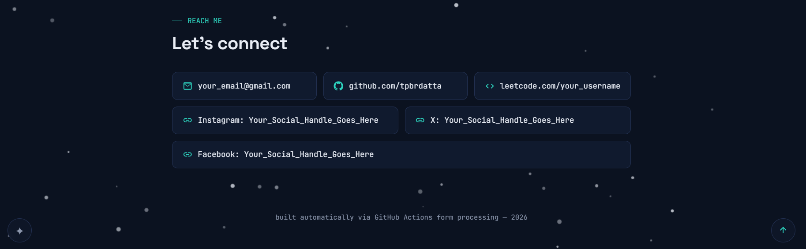

<div align="center">

# ⚡ Terminal Portfolio Generator

### Fork it. Fill one form. Your portfolio is live.



<br>


<br>

[](../../actions)
[](../../stargazers)
[](../../forks)
[](LICENSE)

</div>

---

## 🌈 What is this?

A **code-workspace-themed portfolio** that builds and deploys itself. No manual HTML editing, no server, no dashboard — just a GitHub Issue and a workflow that does the rest.

<table>
<tr>
<td width="33%" align="center">🧩 <b>Zero-code setup</b><br><sub>Fork → fill a form → done</sub></td>
<td width="33%" align="center">📊 <b>Live data</b><br><sub>Real-time GitHub + LeetCode stats</sub></td>
<td width="33%" align="center">🎮 <b>Interactive</b><br><sub>Built-in quiz sandbox</sub></td>
</tr>
</table>

---

## 🆚 Traditional Portfolio vs. This

| | 😩 Traditional | 🚀 terminal-portfolio-generator |
|---|---|---|
| Setup | Manual HTML editing | Fill one GitHub Issue |
| Data | Static, goes stale | 🔄 Live GitHub + LeetCode stats |
| Aesthetic | Generic template | 💻 Code-workspace theme |
| Updates | Re-edit & redeploy by hand | ⚙️ Re-run the Action |
| Interactivity | None | 🧠 Quiz sandbox included |
| Hosting | You configure it | 🌐 GitHub Pages, wired in |

---

## 🛣️ Pick Your Path

<table>
<tr>
<td width="50%" valign="top">

### 🎨 Path A — No Code

*Perfect if you've never touched a terminal.*

1. **Fork** this repo (top right ↗️)
2. `Settings → Actions → General → Workflow permissions` → enable **Read and write**
3. `Settings → Pages` → source: **Deploy from a branch** → `gh-pages` → `/ (root)`
4. `Issues → New Issue` → fill in your details → label it `profile-setup`

✅ Live in under 30 seconds.

</td>
<td width="50%" valign="top">

### 🧙 Path B — Developer

*For anyone who wants local control.*

```bash
git clone https://github.com/YOUR-USERNAME/terminal-portfolio-generator.git
cd terminal-portfolio-generator
npm install
python build.py --local
```

Edit `template.html`, rebuild, push. The Action deploys it.

</td>
</tr>
</table>

---

## ⚙️ How It Works



There's no backend and no database — just GitHub's own primitives, chained together. An issue is really a structured form; the moment it's labeled, the Action parses it, pulls fresh stats from the GitHub and LeetCode APIs, and hands everything to `build.py`, which stamps it into `template.html`. The result gets pushed to `gh-pages`, and GitHub Pages takes it from there.

---

## 🖼️ Preview

<table>
  <tr>
    <td align="center" width="50%">
      <br>
      <sub>💻 <b>Workspace</b> — the code-editor-style landing layout</sub>
    </td>
    <td align="center" width="50%">
      <br>
      <sub>📊 <b>GitHub Stats</b> — live-pulled contribution and repo data</sub>
    </td>
  </tr>
  <tr>
    <td align="center" width="50%">
      <br>
      <sub>🧮 <b>LeetCode Stats</b> — real-time problem-solving performance</sub>
    </td>
    <td align="center" width="50%">
      <br>
      <sub>🎮 <b>Quiz Sandbox</b> — the interactive, customizable quiz panel</sub>
    </td>
  </tr>
</table>

*(example screenshots — replace with your own once your portfolio is live)*

---

## 🗺️ Roadmap

- [ ] 🧩 Additional quiz categories
- [ ] 🎨 Theme customization
- [ ] 📈 More stat integrations (Codeforces, Kaggle, etc.)
- [ ] 🌓 One-click theme switcher in the generated site

---

<div align="center">

### 🚀 [Fork this repo →](../../fork)

**built with**    

</div>
